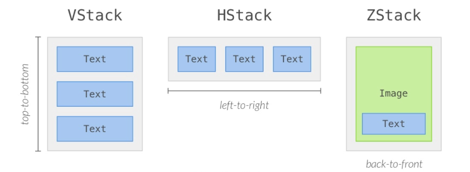
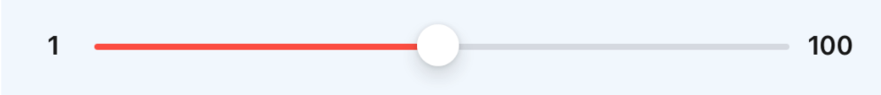
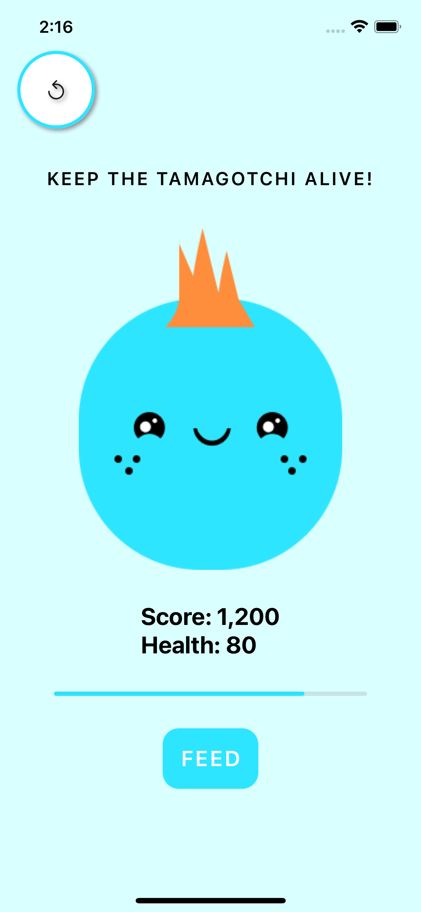

# Hack Sprint Session 3: State and Bindings

**Date**: January 26, 2022

**Location**: Zoom

**Teachers**: [Katelyn Yu](https://github.com/katelynsyu), [Eugene Lo](https://github.com/euglo)

## Resources

- [Slides](https://docs.google.com/presentation/d/1kO9elgFystbMWY24HPOouiGw71A2-PFp7uG9zgpywNA/edit?usp=sharing)
- Workshop recording (coming soon)

Hello, and welcome to session 3's README! If you're here for the solutions to the demo exercises, click [here](#demo-exercise-solutions). Otherwise, read on!

## What we'll be learning today

- [Views and View Modifiers](#views-and-view-modifiers)
  - [Review Views](#review-views)
  - [New Views](#new-views)
  - [Text View Modifiers](#text-view-modifiers)
  - [Image View Modifiers](#image-view-modifiers)
  - [Button View modifiers](#button-view-modifiers)
  - [Safe Area](#safe-area)
- [Making our Tamagotchi App](#making-our-tamagotchi-app)
  - [Adding Our Views](#adding-our-views)
- [Closures](#closures)
  - [Syntax](#syntax)
- [State](#state)
- [Bindings](#bindings)
- [Demo Exercise Solutions](#demo-exercise-solutions)

## Views and View Modifiers
### Review Views
Previously, we covered that views are essentially the building blocks that allow you to add content to the screen until it is in the state you desire. Some common views we have gone over are **Text** and **Image**.

Text displays lines of text to the screen. The syntax is:
```swift
Text("Hi, my name is Shirokuma, and I like hot tea.")
```
This writes the words "Hi, my name is Shirokuma, and I like hot tea." to the screen of your app. (Shirokuma, for those of you who don't know, is a Sumikkogurashi character-- a shy polar bear who migrated south to avoid the cold and feels most calm while drinking hot tea in a corner.)

Image places the image of your choice from the *Assets* folder, which is provided by default by Xcode, onscreen. The syntax is:
```swift
Image("ShirokumaAndTea")
```
This will display the image in your Assets folder that is named "ShirokumaAndTea" on the screen.

We have also covered VStack:
```swift
VStack {
  View1
  View2
}
```
which allows us to align views vertically down the screen, and HStack:
```swift
HStack {
  View1
  View2
}
```
which allows us to organize views horizontally across the screen.

### New Views
Now, let's talk about some other common views, starting with **ZStack**--and you thought you were done with stacks ;)

ZStacks allow you to stack views in front of and behind each other in a pile (stacking up in the z-direction). You can imagine z-direction to be coming directly towards you off of the screen, while HStack and VStack, are in the left/right and up/down directions, respectively. The first view listed will be in the way back, and the last view will be the frontmost view of the pile. For example,
```swift
ZStack {
  Image("ShirokumaAndTea")
  Text("Hi, my name is Shirokuma, and I like hot tea.")
}
```
This ZStack will output the text "Hi, my name is Shirokuma, and I like hot tea." layered on top of the image "ShirokumaAndTea".

The following diagram highlights the differences between VStack, HStack, and ZStack:



Ok. We have aligned our views, but they're so oddly scrunched up on screen. How can we fix this so that views can breathe and be farther apart? **Spacers**.

In a stack (HStack or VStack), you can use a Spacer to (guess what?) *space* things out. A Spacer takes up as much space as possible on the screen, so
```swift
VStack {
  View1
  Spacer()
  View2
  View3
}
```
shoves View1 all the way to the top of the screen and pushes View2 and View3 to the bottom.
Spacers happen to work well together, so you can have multiple in a stack, making something like
```swift
VStack {
  View1
  Spacer()
  View2
  Spacer()
  View3
}
```
This results in View1, View2, and View3 being equidistant from each other, with View1 at the top of the screen, View2 midway down, and View3 at the bottom. You can rearrange the spacers to organize your views any way you'd like.

One last view to cover today: buttons. Buttons are very self-explanatory--they're views that the user can click on onscreen that will allow an action to occur. We'll talk about actions a little later. For now, the syntax to create a button is:
```swift
Button (action: {
  //action
  }) {
    Text("Drink Tea")
}
```
This creates a button that has the text "Drink Tea" on it.

So... now that we know how to make things show up, how to align said newly-spawned views, and how to space them out all fancy, how do we make them look *pretty*?

### Text View Modifiers
View modifiers. View modifiers are the answer to making things look pretty. Previously, we discussed that view modifiers tend to follow the format
```swift
View
  .modifier()
  .modifier()
```
Each modifier will style the view in a specific way.

Let's go over some text view modifiers. During session 1, we covered the `.bold()`, `.italic()`, `.foregroundColor()`, and `.background()` view modifiers, which bold, italicize, color the text, and color the background of the text, respectively.

Some new modifiers pertaining to the Text view are `.tracking()`, `.font()`, and `.lineSpacing()`. These view modifiers will allow you to add spacing between characters, change the font style, and change the line height.

### Image View Modifiers
Now for images, we've used `.resizable()`, `.frame()`, and `.scaledToFit/Fill()` to make our images the size we want onscreen. Some new view modifiers that might be of interest are `.cornerRadius()`, `.shadow()`, and `.border()`. `.cornerRadius()` rounds the edges of the view to the radius that you specify (higher corner radius means a rounder view), `.shadow()` creates a drop shadow of your color and size preference, and `.border()` creates a colored border around your image.

Additionally for images, you can use the `.overlay()` modifier. `.overlay()` layers another view on top of the view you currently have. For example, if you wanted to create a circular image...
```swift
Image("ShirokumaAndTea")
  .overlay(Circle())
```
you could use overlay to do so. You can also overlay views that are other shapes, such as `Ellipse()`, `Rectangle()`, `Capsule()`, etc.

These shapes can have their own view modifiers like `.fill()` and `.stroke()`/`.strokeBorder()`. `.fill()` fills the shape with the color of your choice. `.stroke()` and `.strokeBorder()` add an outline of your specified color and line width to the shape.

### Button View Modifiers
Next on the view modifiers list, we'll talk about buttons. Buttons are easy to talk about now that we've covered the other views and view modifiers. You can use text view modifiers like `.tracking()`, `.font()`, and`.foregroundColor()` in order to style the buttons's text. `.background()` changes the color of the button itself. You can use image view modifiers like `.cornerRadius()`, `.shadow()`, and `.border()` on buttons as well.
```swift
Button(action: {
  //action
  }) {
    Text("Drink Tea")
      .font(.headline)
      .bold()
      .tracking(3)
      .foregroundColor(Color.white)
}
.padding()
.background(Color.black)
.cornerRadius(15)
```
This code will create a button with text "Drink Me" displayed on it. The text is styled in the headline font format, is bolded, has letter spacing of 3, and is white. The button itself will have padding (the boundaries of the button will be extended beyond the text itself), it will be black, and it will have rounded edges with corner radius of 15.

### Safe Area
One last thing about views and view modifiers: the entire device screen is included in a view--the background view. When you attempt to lay a background image or color for your app to cover the entire screen, you might notice white spaces at the top and bottom of the screen of certain devices like the iPhone 13. The background is cut off by the *safe area* which is the area at the top and bottom of the screen that might have important information on it, like the time and battery level at the top of the iPhone13, that apps might not want to cover. If you have committed, and you want to cover the safe area with your chosen background then here's the view modifier for you:
```swift
Color(Color.blue)
  .ignoresSafeArea()
```
This code will color the background of your screen blue, extending the coloring into the safe area and covering the entirety of the screen.

To learn more about the view modifiers we have talked about, you can check out the [Apple developer docs](https://developer.apple.com/documentation/swiftui/views-and-controls) and look at the demo code to see how they are used.

## Closures

It's time to learn a new concept in Swift (I know, you're trembling in excitement right now)! Today, we'll be covering **closures**.

Up to this point, we've been hand-waving closures without ever really addressing them, so you might not even know that we've already seen them a couple of times. Take this piece of code to make a `Button` you just saw, for example:

``` swift
Button(action: {
  //action
  }) {
    Text("Drink Tea")
}
```

For simplicity's sake, we took out all of the view modifiers.

Have you ever looked at the curly mess made by all of the `{}` braces and were confused about they were used for? Well, let's slightly modify the `Button` to a form you may be more familiar with:

``` swift
func printWisdom() {
  print("Yesterday is history, tomorrow is a mystery.")
	print("But today… is Wednesday 🤔")
}

Button(action: printWisdom) {
    Text("Drink Tea")
}
```

The `action` parameter of `Button` is expecting a function as its input, which we have provided with the `printWisdom` function. This is the function that the `Button` will run whenever it is pressed by the user (note that it is important that we pass in the function `printWisdom` itself, and not `printWisdom()`. The latter will actually call the function and pass in the return value of the function, which in our case is nothing, because it's only printing things out).

This is all fine and dandy, but what if I told you can *directly pass* just the code block itself as input, which is enclosed by the curly braces `{}`? That would look something like this:

``` swift
Button(action: {
  print("Yesterday is history, tomorrow is a mystery.")
	print("But today… is Wednesday 🤔")
}) {
    Text("Drink Tea")
}
```

This is what a closure is! **Closures** are self-contained blocks of code that can be passed around just like normal variables! You can think of them as syntactic sugar, i.e. they are basically functions that you don't have to explicitly write out and give a name to.

### Syntax

Let's take a look at a closure's generic syntax:

``` swift
{ (parameters) -> return_type in
	// code here
}
```

If this looks uncannily similar, it is! This is a Swift function's syntax:

``` swift
func funcName(parameters) -> return_type {
	// code here
}
```

The components of a closure and function line up almost one-to-one, with a couple of exceptions. For instance, both require you to specify the parameters separated by commas within parentheses (actually, you can leave the parentheses out for closures if there's only a single parameter, but you can be safe and just always add them). After the parameters comes the `->` (dash-angled bracket) symbol, which separates the parameters and the return type, which is a Swift data type. Finally, you have the function body, where you put the code you want your closure/function to run.

Now come the differences. While the parameters and return type come before the opening brace `{` for functions, everything comes within the curly braces for closures. Additionally, we have the `in` keyword for closures, which separates the parameters and return type from the actual function body. Finally, closures don't have names, whereas you are required to provide a name to functions so that you can call them later.

There are also some nifty shortcuts for closures. If you have no parameters or return type (like our previous `printWisdom` function), you can omit the parameters, return type, and `in` keyword. Additionally, if your closure only has a single line of code, which is the return statement itself, you can leave out the `return` keyword and just write the statement whose value you want to return itself.

Here's another example that showcases all of these differences and shortcuts more succintly. We define an `addNums` function, which adds the parameters `num1` and `num` and returns the sum:

``` swift
func addNums(num1, num2) -> Int {
	return num1 + num2
}

{ (num1, num2) -> Int in
	num1 + num2
}
```

We have yet to cover another part of the `Button` that uses a closure - the closure that comes *after* the closing parenthesis `)`:

``` swift
// ... previous Button code
) {
    Text("Drink Tea")
}
```

You may be wondering, "how is this possible??" How are we writing more code after we closed off the parentheses? Well, this is yet another shortcut Swift provides with closures, where if the *last* parameter of a struct is expecting a function as input, you can instead write a closure that comes *after* the parenthesis. You may be noticing a common trend in Swift where theres a lot of little nice-to-haves in your syntax. It's quite nice.

We've actually already seen this shortcut in action! One other exapmle we've seen is with `VStack`:

``` swift
VStack {
	Text("Drink Tea")
}
```

VStack's last parameter is actually `content`, which is expecting a function that returns a view with content to display. Here is the actual form of `VStack`'s constructor:

``` swift
VStack(alignment: /* alignment value */, spacing: /* spacing value */, content: {
	Text("Drink Tea")
})
```

Note that `alignment` and `spacing` are parameters that can be optionally specified to further fine-tune the structure of your `VStack`.

One rule of thumb to follow while deciding whether or not to use a closure or function is to ask yourself: "Will I be using this block of code multiple times throughout my app?" If the answer is yes, use a function, so that you can call the function name itself  (e.g. `printWisdom()`) and avoid duplicating the same code over and over again. However, if you anticipate only needing the block of code once (e.g. only when a specific button is pressed), it is oftentimes better to use a closure.

Hopefully this section gave you *closure* about what exactly we've been doing in our sessions. Heh.

## State

### Motivation

One important use case to have in an app is to be able to update a variable's value and have that change reflect in the app. If you're following along with our workshop (or the recording), this comes in the form of our Tamagotchi's health bar. We want it to be so that when we press the "Feed" button, the health of the Tamagotchi will increase by a set amount. We want this change to automatically update the view to display the most recent value of the health. Our code for this within `ContentView` might look as such, where we define the `health` variable and attempt to increment it within the `Button` action:

``` swift
var health: Double = 50.0

var body: some View {
	// ... other views
  Button(action:{
    health += 5.0
  }) {
    Text("FEED")
      .font(.title3)
      .bold()
      .tracking(2)
      .foregroundColor(Color.white)
  }
  .padding()
  .cornerRadius(15.0)
  // ... other views
}
```

If you attempt to build this code, however, Xcode will scream at you with the following error: `Left side of mutating operator isn't mutable: 'self' is immutable`

Why is it saying this? Well, `ContentView` is a struct, and here `health` is a property of the `ContentView` struct. In Swift, struct properties are immutable, meaning that once you assign them, you can't reassign them (there's some leeway if you reassign a property of an object which *itself* is a property of the struct, but I digress). This only means trouble for us, because we need to increment health by `5`, then reassign that back to the `health` variable so that everything works.

This would typically mean disaster if there was no way to handle this, but luckily there is a way to explicitly tell SwiftUI to "monitor" certain values and allow them to change values within structs. Not only this, but SwiftUI will automatically update views to always display the most recent value of a variable. These special kinds of variables are called **state** variables, and they are extremely fundamental in making interactive apps using SwiftUI!

### Definition

State variables can be read or written just like any other normal variable, with the exception that whenever their values are changed, the view will automatically update with its current value. 

One analogy that can help you understand the concept of state variables is a car. When it comes to cars, you have a lot of internal data that you need to keep track of: the fuel level, the current speed, etc. These are "sources of truth", meaning they directly indicate the current state of our car. However, this is not entirely useful to us, because it is impossible to know exactly what our fuel level or speed is without some visual indicator. This is why we have a dashboard in front of us, with dials that display what the current fuel level is, and what the current speed is. 

It is *extremely* important that the data displayed on the dashboard is up to date with the current state of the car. Imagine if the dashboard said we had enough fuel left when in reality it is about to run dry, or that we are going at 30 mph when it is actually 100 mph. That would be a big nono!

In a similar vein, state variables are our "source of truth", as they serve as the singular point of reference for data for the rest of the app. By themselves, they are just variables that we won't see as users of the app. That makes it all the more important to display them to the user within views, with the underlying notion that these views directly reflect the most recent version of the state variable.

### Syntax

The syntax for declaring a variable as a state variable is as follows:

``` swift
@State private var isAwake = false
```

You may notice that this is almost the same as declaring a normal variable, except we also add the `@State` annotation in the front to indicate this is a state variable. You may also notice we add the `private` keyword. Without going into too much detail, adding `private` to a variable declaration makes it so that this specific variable is only accessible within the struct itself. Adding `private` is just convention when it comes to state variables, so we'll be following that here.

Looking back to our previous example, once we update the `health` variable as such:

``` swift
@Staet private var health: Double = 50.0
```

The error in Xcode will disappear. I love when it does that.

### Usage

State variables are not only used to display a variable using a view, but can also be used to define *different* actions to take depending on what value the state variable currently is. For example, imagine we have a boolean variable, `gameIsRunning`, which keeps track of whether a game is currently ongoing (`true`) or not (`false`). If `gameIsRunning` is true, we can do things like start a timer, increase the current score, and allow the user to tap a button. If `gameIsRunning` is false, however, we can disable that same button so that users can no longer press it, stop increasing the score, and stop the timer. In SwiftUI, we write out the code for *both scenarios*, and we leave it to the user to flip the state variable's value. The app will update its views accordingly.

The following code snippet is taken from the demo and showcases one instance of how different values of the state variable change the behavior of the app: 

``` swift
if game.isRunning {
  game.health = max(game.health - dyingRate, 0.0)
}

if game.health == 0.0 {
  game.isRunning = false
}
```

Here, we have a `game` object that has `health` (Double) and  `isRunning` (Bool)  as properties. `game` itself has been declared a state variable, so all of its properties will be monitored by SwiftUI, as well. We see that we check whether or not the game is running in `if game.isRunning`. If it is, we will decrease the health by a set amount. However, if the health reaches 0, we flip the value of `game.isRunning` to false. This means that health will no longer decrease, and the game is considered "over".

## Bindings

### Motivation

Sometimes, state variables are not enough when we have more complicated relations. In these cases, not only do we want to provide data to another view, but we also want that latter view to be able to modify our original view's state variables as well.

First, some terminology. When we talk about the view that contains other views, we call this the **parent view**. By convention, this view includes our state variables as properties. The views that are contained within the parent view are called the **child views**, because the parent view is surrounding them. These child views may have their own data as well, but for the most part their properties should be linked to the parent view.

With what we've learned so far, if we try to change a property within a child view, we'll run into the same error as before, telling us that `self` is immutable. To fix this, we need to create a **binding**.

### Definition

**Bindings** are a two-way association between a property in the child view and a state variable in a parent view. When the parent view updates a state variable, the child view's property that is bound to this variable will also update. Conversely, when the child view modifies this property, the state variable in the parent view will also reflect this change.

### Syntax

The syntax for bindings is two-part, because we have to both declare a binding within a child view and also mark a state variable in the parent view as a binding.

Declaring a binding property (within the child view):

``` swift
@Binding var value: Double
```

The syntax to declare a binding is identical to a normal property, with the addition of the `@Binding` annotation.

Binding a state variable to a child view (within parent view): 

``` swift
ChildView(value: $stateVariable)
```

An interesting thing is happening here. To bind a state variable `stateVariable` to the `value` property within the ChildView, we have to add a dollar sign `$` before the state variable.

#### Case Study: Slider

As an example of bindings at play, we'll take a look at a particular view in SwiftUI: the Slider.



The slider takes in two parameters: the `in` parameter, which specifies the start and end values of the slider in the form of a range (e.g. `1...100`), and the `value` parameter, which takes a numerical value that the slider will be set to.

If you try to pass a normal Double as input to the `value` , you'll get an error. Why? Because it's expecting a binding. If you think about the use cases of a slider, the reason will make sense. Not only do we need to pass a value into the Slider (our child view) so that it is able to display a value, but we also need to allow the users *themselves* to manipulate the slider, so that when the user moves the slider around, the original state variable also gets its value changed as well. Without bindings, this two-way communication would not have been possible!

## Demo Exercise Solutions

In the session, we gave two exercises:

1. Implement the Restart Button
   - The button should:
     - Set the game to be running again
     - Set health back to 50
     - Set score back to 0
2. Create a custom TamImageView to handle different Tam emotions
   - If health >= 50, set image to HappyTam
   - If health = 0, set image to DeadTam
   - Else, set image to SadTam

All the assets mentioned above are made available in the [starter demo](https://github.com/uclaacm/hack-sprint-w22/tree/main/session-3-state-and-bindings/session3-complete-demo/session3-demo-starter)!

### Implement the Restart Button

To approach this problem, I created my own custom image View in a new SwiftUI file, which I called `RestartImageView`. The `RestartImageView` is as follows:

``` swift
struct RestartImageView: View {
  var body: some View {
    Image(systemName: "arrow.counterclockwise")
      .frame(width: 40, height: 40)
      .padding()
      .foregroundColor(Color("TextColor"))
      .font(.title)
      .background(Circle().fill(Color.white))
      .shadow(color: Color.gray, radius: 2, x: 2, y: 2)
      .overlay(
        Circle()
          .strokeBorder(Color("TamColor"), lineWidth: 3)
      )
  }
}
```

You may notice that I am passing a `systemName` parameter here. I am using something called [**SF Symbols**](https://developer.apple.com/sf-symbols/), which is a library of icons provided by Apple. You can download the latest version and browse the icons yourself, but to save some time we use the `arrow.counterclockwise` symbol here, which is the "undo" arrow we're looking for. Once you pass the name of the symbol as a string to the `systemName` parameter of `Image`, it will render with the correct SF symbol.

The rest of the view modifiers are used to achieve a circular image with a white background and blue-ish border of line width 3. If you're wondering why we're drawing two separate Circles, one with a fill color and one with a stroke border color, it's because SwiftUI doesn't provide a built-in way to fill *and* stroke at the same time, so we have to put one as the background and one as the overlay with a border. This [example](https://www.hackingwithswift.com/quick-start/swiftui/how-to-fill-and-stroke-shapes-at-the-same-time) provides other workarounds as well.

You may also notice how we pass a string to the `Color`. These strings are the name of a **color set** we have defined for you in the Assets folder. To declare your own custom color set, right click anywhere on the Assets page and select "New Color Set". You can use the color picker on the bottom right to select a color you desire, or enter a specific "RGB" or hex code for your color (different ways to specify a color using number/letter values). For more information on how to do this, look [here](https://betterprogramming.pub/custom-colors-and-modifiers-in-swiftui-a093c243c126).

Now, within `ContentView` we simply write the following code at the top of our body:

``` swift
HStack {
  Button(action: {
    game.restart()
    self.timer = Timer.publish(every: 1, on: .main, in: .common).autoconnect()
  }) {
    RestartImageView()
  }
  Spacer()
}
```

Why are we placing the button in an `HStack` with a `Spacer` following it? You may notice in our complete demo that the button is on the top left corner. By adding a `Spacer` within the `HStack`, we are accomplishing this by pushing the the button as left as possible.

Within the `action` parameter, we are also resetting the timer by reinitializing it. We also call the `restart()` function of `game`, which is a helper method I added to simplify resetting all the values.

`Game.swift`:

``` swift
mutating func restart() {
  health = 50.0
  score = 0
  isRunning = true
}
```

Note that if we don't add the `mutating` keyword here, there will be an error. Whenever a method in a struct modifies the values of properties, we have to declare it as a `mutating` func to let Swift know that properties will change.

### Create a Custom TamImageView

We define a custom Image view, `TamImageView`, in a separate file as such:

``` swift
struct TamImageView: View {
  var health: Double
  
  var body: some View {
    Image(chooseImage())
  }
  
  func chooseImage() -> String {
    if health >= 50.0 {
      return "HappyTam"
    } else if health <= 0.0 {
      return "DeadTam"
    } else {
      return "SadTam"
    }
  }
}
```

The `TamImageView` uses a function `chooseImage()` to determine what image to display depending on the current value of the `health` property. We use an `if-else` condition check for this to account for each possible vlue.

In `ContentView`, the `TamImageView` is called like this:

``` swift
TamImageView(health: game.health)
```

### Complete Demo

With these exercises, you will have completed all of the requirements for our app! The final product should look something like this:


